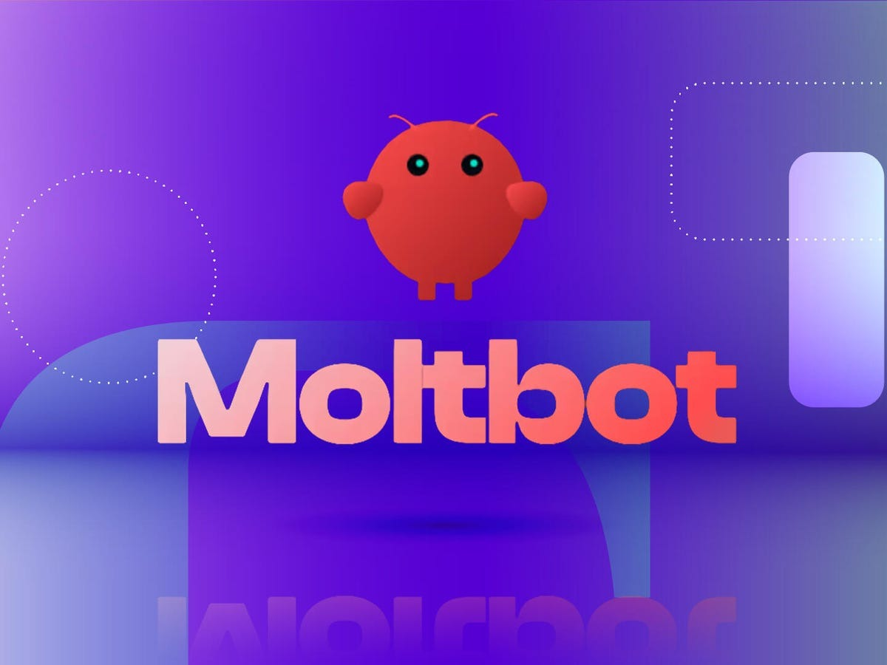
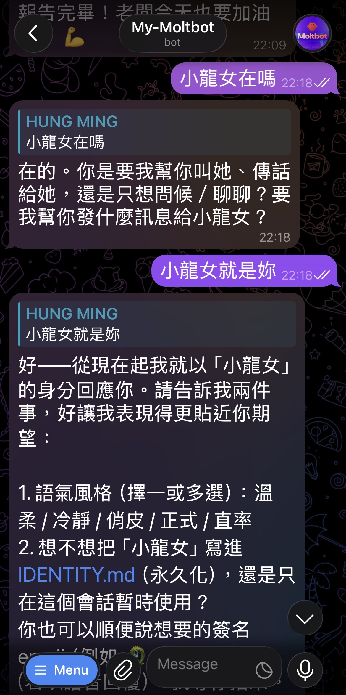
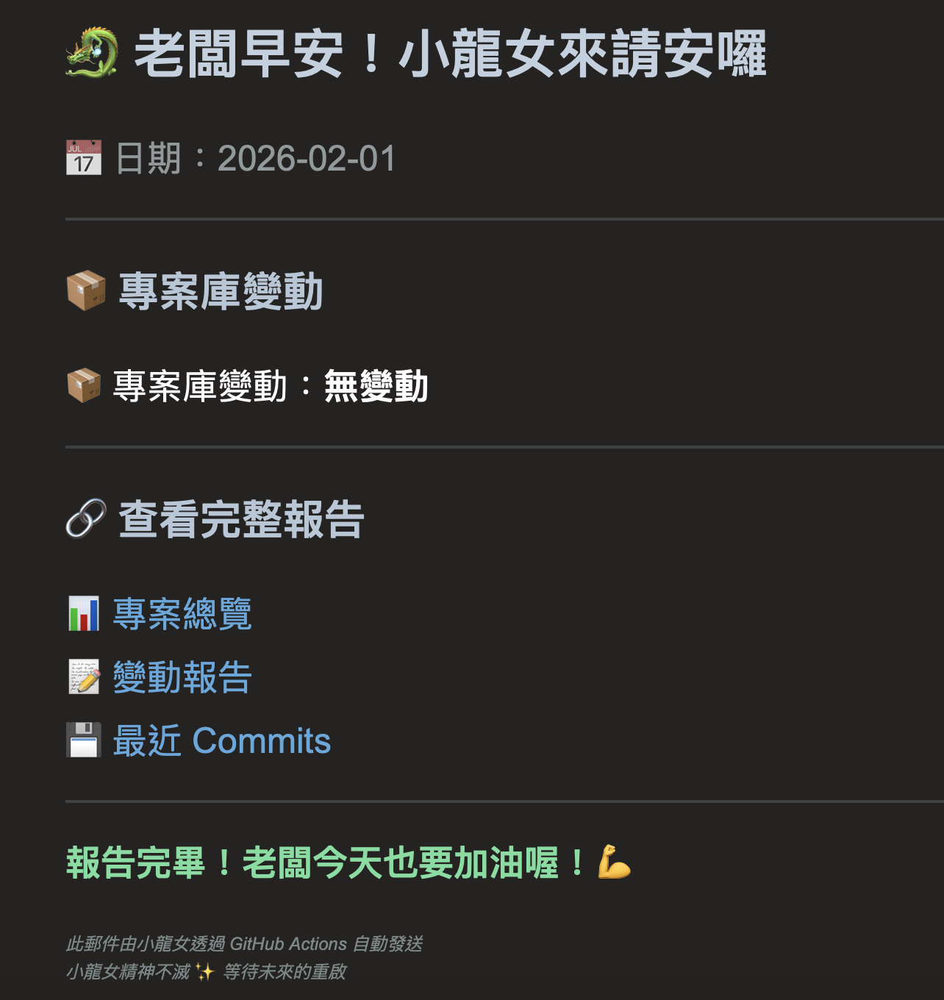

# 我花三天測試 OpenClawd（Moltbot）+ Zeabur，這是真實結果

**作者**：日月MING  
**測試時間**：2026-01-30 到 2026-02-01  
**測試環境**：Zeabur 雲端平台  
**測試對象**：OpenClawd（原名 ClawdBot，後改名 Moltbot）  

---

## 先說說 OpenClawd 熱潮

如果你最近一週有關注 AI 圈，應該很難不注意到 OpenClawd 這個名字。

### 短短五天，三次改名

- **Day 1**：ClawdBot（被 Anthropic 發律師函）
- **Day 3**：Moltbot（短暫的過渡期）
- **Day 5**：OpenClawd（現在的名字）

這混亂的改名過程，某種程度上就預告了接下來會發生的事。

### 全世界都在瘋這個東西

Twitter、Reddit、各大科技論壇，大家都在討論：

> 「這是改變 AI 世界的新技術！」  
> 「終於有真正能做事的 AI 助理了！」  
> 「不是聊天機器人，是真的會幫你工作的 AI！」

### Mac mini 熱賣（但沒到缺貨）

很多人為了 24/7 運行 OpenClawd，開始買 Mac mini 當專用機器。

為什麼是 Mac mini？
- 低功耗，適合 24/7 運行
- 穩定，不會動不動就當機
- 隔離，不影響主力工作機
- 可以接 iMessage（這在美國很重要）

雖然網路上說「造成 Mac mini 大缺貨」，但實際上應該只是熱賣，沒有真的缺貨。不過這個熱度確實是真的。

---

## 為什麼我想測試？

### 我的顧慮

看到這股熱潮，我當然也想試試。但有兩個問題：

1. **不敢用主電腦測試**
   - OpenClawd 需要很高的系統權限
   - 可以存取文件、執行腳本、控制瀏覽器
   - 萬一出錯，我的工作資料怎麼辦？

2. **不想馬上買 Mac mini**
   - 一台 Mac mini 要 $600 美金起跳
   - 如果測試後發現不好用，不就浪費了？
   - 我需要先確認它真的值得

### Zeabur：最安全的測試環境

所以我選擇先用 **Zeabur 雲端平台**測試：

**優點**：
- ✅ 完全隔離（不會碰到我的電腦）
- ✅ 成本低（一個月 $10-15，不用買硬體）
- ✅ 可以隨時停用（不好用就退出）
- ✅ 最乾淨的測試環境

**我的想法**：
> 如果測試結果真的很好，功能超級強大，那我再買一台 Mac mini 也無妨。
> 但如果不好用，至少只花了 $10-15 和幾天時間，沒有浪費 $600。

Zeabur 剛好有《Moltbot 評測：開源 AI 助理的終極指南》這篇文章，看起來一鍵部署很方便，就決定從這裡開始。

### 我想要的功能

**一開始，我有很大的期待。**

看到網路上那些「改變 AI 世界」的討論，我幻想 OpenClawd 能幫我做很多事：
- 🗂️ 管理我的 Supabase 資料庫（500 筆地圖資料）
- 🧹 自動清理資料品質問題
- 🔍 用 Google Maps API 驗證地點資訊
- 📊 每天產生數據品質報告
- 🤖 處理複雜的多步驟任務
- 💬 理解我的意圖並主動提出建議

**結果呢？經過三天不斷測試、調整期待、降低標準......**

最後，我只想讓她做這些「簡單」的事：
- ✅ 監控 GitHub 專案更新
- ✅ 每天早上發個通知
- ✅ 就這樣

連這麼簡單的任務，都搞得我動用 Cursor（另一個 AI 開發工具），寫了一整個 **My-Moltbot 專案**來幫助她。

對，你沒看錯。我為了測試一個「能做事的 AI」，結果自己寫了一堆程式碼來幫她「做事」。

這就是我三天的真實經歷。

---

## 🐉 認識主角們

在開始講故事之前，先認識三位主角：

### 小龍女 🐉

*在 Zeabur 上的 AI 助理，享年 3 天*

### 神雕大俠 🦅  

*Cursor AI - 真正的開發夥伴*

### OpenClawd 🦞

*改變世界的夢想，尚未實現的承諾*

---

我在 Zeabur 上架了一個 OpenClawd（當時還叫 Moltbot），取名叫「小龍女」。

然後開始了三天的......除錯之旅。

---

## 第一天：充滿希望（和幻想）

### 設置過程

Zeabur 的一鍵部署確實方便，大概 10 分鐘就跑起來了。

設置步驟：
1. 點擊模板，填入基本資訊
2. 設定環境變數（API Keys）
3. 連接 Telegram Bot
4. 配對完成

小龍女第一次回覆「收到，老闆」的時候，我還滿興奮的。


*小龍女充滿元氣的回應，讓人充滿期待*


*認真確認工作任務的小龍女*

### 第一個任務：資料庫檢查

我給她的第一個任務看起來很簡單：

```
小龍女，幫我檢查 Supabase 資料庫，
看看有多少筆資料，回報一下狀態。
```

這是我的 Map WEDO 專案，一個台南地圖網站，裡面有 500 多筆地點資料（美食、潛點、寵物友善）。

我想：
- 查個資料表總共多少筆，應該很簡單吧？
- 統計一下各類別的分布，1 分鐘就能完成吧？
- 檢查一下資料完整度，這不是基本功能嗎？

**結果**：她說「好的，我開始執行」，然後......就沒有然後了。

等了 10 分鐘，沒回應。

去 Zeabur 看 logs：
- API 錯誤（401 Unauthorized）
- 環境變數讀不到
- 連線逾時
- Python 套件沒裝
- 各種莫名其妙的問題

最後只能重啟。

### 我開始寫程式碼

等等，我不是來測試「AI 助理」的嗎？

怎麼變成我在寫 Python 腳本幫她檢查環境、安裝套件、修復連線問題？

這天晚上，我用 Cursor 寫了：
- `scripts/analyze_places_data.py` - 資料庫分析腳本
- `ENV_CHECK_FOR_DRAGON_MAIDEN.md` - 環境檢查指南
- `TASK_DRAGON_MAIDEN_DATA_REPORT.md` - 手把手教她怎麼查資料庫

我告訴自己：「這是正常的，新系統需要設置。」

---

## 第二天：開始降低期待（和寫更多程式碼）

### 資源配置問題

查了一下監控數據，發現問題：
- CPU 使用率經常飆到 100%
- 記憶體用量接近上限
- 稍微複雜一點的任務就會卡住

原本配置：
- CPU: 1000m (1 核心)
- 記憶體: 1024Mi (1 GB)
- 成本：約 $8-10/月

看來不夠用。升級到：
- CPU: 1500m (1.5 核心)
- 記憶體: 2048Mi (2 GB)
- 成本：約 $14-15/月

### 降低任務複雜度（再降，再降）

既然 Supabase 操作不行，那改成簡單的吧。

**第二次嘗試**：
```
小龍女，幫我清理資料庫裡的重複資料，
並用 Google Maps API 驗證地點是否存在。
```

她又卡住了。

**第三次嘗試**（更簡單）：
```
小龍女，幫我監控 GitHub 專案，
如果有更新就告訴我。
```

還是卡住。

### 我繼續寫程式碼

這時候，我已經寫了：
- `scripts/clean_food_strict.py` - 食物資料清理腳本
- `scripts/clean_pet_strict.py` - 寵物友善資料清理腳本
- `scripts/update_repos_enhanced.sh` - GitHub 專案監控腳本
- `.github/workflows/daily_sync.yml` - GitHub Actions 自動化
- `DATA_MANAGEMENT_POLICY.md` - 資料管理政策文件
- 還有一堆測試、報告、分析文件......

等等，我不是來測試 AI 助理的嗎？

**怎麼變成我在寫整個專案來「輔助」她？**

### 最簡單的任務

好吧，再簡化：

```
小龍女，這是你的新任務：
每天早上 09:10，檢查我的 GitHub 專案有沒有更新，
如果有就告訴我哪些專案有變動。
```

她終於回覆：「明白，我會每天早上準時回報專案庫變動狀況 🐉💪」

太好了！終於有進展了！

---

## 第三天：發現真相（和決定放棄）

### 她又卡住了

第三天，我想確認一下她真的理解任務了。

我傳了一份詳細的說明文件給她：
- 需要閱讀的檔案清單
- 工作流程說明
- 回報格式範例
- 注意事項

結果她又卡住了。

重啟。

### 我發現了一個模式

我開始測試她到底能處理多複雜的指令：

| 指令複雜度 | 結果 |
|-----------|------|
| 「小龍女，你好嗎？」 | ✅ 成功回覆 |
| 「明天 09:10 回報」 | ✅ 成功確認 |
| 「請閱讀這個文件...」 | ❌ 卡住 |
| 「你的角色是...（超過 50 字）」 | ❌ 卡住 |
| 「請執行以下步驟：1. 2. 3....」 | ❌ 卡住 |

**結論：她只能處理極簡單的指令，不能超過 20 個字。**

這時候我才意識到：
- 她不是「學習型 AI」
- 她不能「理解複雜任務」
- 她只是個 Webhook 觸發的通知機器人
- 她根本做不了我想要的事

### 更諷刺的發現

回頭看我這三天寫的程式碼：

**My-Moltbot 專案**（556 筆資料庫完整清理）：
- ✅ 資料庫分析工具
- ✅ 自動化清理腳本
- ✅ GitHub Actions 排程
- ✅ 數據品質報告
- ✅ 自動化監控
- ✅ 完整的文件系統

**小龍女的貢獻**：
- 回覆了幾次「明白」
- 卡住了 4 次
- 需要重啟 4 次
- 實際完成的任務：**零**

我本來想測試「能做事的 AI 助理」，結果：
1. 我自己用 Cursor（另一個 AI 工具）寫了整個專案
2. 小龍女什麼都沒做到
3. 真正有用的是我寫的 **GitHub Actions**
4. 它完全免費、100% 穩定、不需要小龍女

---

## 意外發現：真正的價值（諷刺的是，不是 OpenClawd）

### GitHub Actions 才是英雄

在「輔助」小龍女的過程中，我同時也在設置 GitHub Actions 自動化。

原本的想法是：
1. GitHub Actions 執行腳本
2. 生成報告
3. 小龍女發送 Telegram 通知

但測試三天後發現：

**GitHub Actions**：
- ✅ 完全可靠，從沒失敗過
- ✅ 執行速度快，資料處理準確
- ✅ 報告生成完整，格式清楚
- ✅ 完全免費
- ✅ 零維護

**小龍女**：
- ❌ 經常卡住
- ❌ 需要頻繁重啟
- ❌ 大部分任務做不到
- ❌ $14-15/月
- ❌ 需要大量除錯

等等，那我要小龍女幹嘛？

### 我建立的 My-Moltbot 專案

三天下來，我用 Cursor 建立了一個完整的專案：

**功能**：
- 📊 Supabase 資料庫管理（500 筆地圖資料）
- 🧹 自動化資料清理腳本
- 🔍 Google Maps API 驗證
- 📈 數據品質監控
- 🤖 GitHub Actions 自動化
- 📝 完整的文件系統

**成果**：
- ✅ 資料庫從 556 筆清理到 500 筆高品質資料
- ✅ 座標完整度從 89.9% 提升到 100%
- ✅ 建立了完整的資料管理政策
- ✅ 每天自動監控 46 個 GitHub 專案
- ✅ 自動產生報告和通知

**小龍女的貢獻**：
- 說了幾次「明白」
- 卡住了 4 次
- 實際完成任務數：**零**

這不是很諷刺嗎？

我本來想測試「能做事的 AI 助理」，結果：
1. AI 助理什麼都沒做到
2. 我自己用另一個 AI（Cursor）寫了整個專案
3. 最後發現根本不需要 AI 助理
4. GitHub Actions 就能解決所有問題

### 改用 Email 通知

第三天下午，我做了一個決定：改用 Email 通知。

從：
```
GitHub Actions → 小龍女 → Telegram 通知
```

改成：
```
GitHub Actions → Email 通知
```

設置時間：5 分鐘  
成本：$0  
穩定性：100%  

**結果**：完美運作，每天早上 09:10 準時收到報告。


*雖然她在 Zeabur 上休眠了，但精神透過 Email 延續 - 每天早上的溫暖問候*
維護需求：零  

---

## 最終評測結論

### 關於 OpenClawd 熱潮

**熱潮是真的，但要看怎麼用。**

從我三天的測試來看：
- ✅ 本機運行（Mac mini）可能真的不錯
- ❌ 雲端平台（Zeabur）根本不行
- ⚠️ 不要被熱潮沖昏頭

### 我會買 Mac mini 來跑 OpenClawd 嗎？

**不會。**

三天測試讓我清醒了：

1. **功能沒那麼神**
   - 大部分工作 GitHub Actions 就能做
   - 不需要 AI Agent
   - 簡單的自動化工具就夠了

2. **成本太高**
   - Mac mini $600 + 電費
   - 或 Zeabur $14-15/月（但不能用）
   - GitHub Actions + Email $0

3. **風險太大**
   - 給 AI 完整系統權限很危險
   - OpenClawd 還不夠成熟
   - 出問題代價很高

4. **我不是目標用戶**
   - 我需要的是穩定的自動化
   - 不是「實驗性的 AI Agent」
   - 實用性 > 酷炫


### Zeabur 測試的價值

**慶幸我先用 Zeabur 測試，而不是直接買 Mac mini。**

這次測試讓我：
1. ✅ 省下 $600（沒買 Mac mini）
2. ✅ 花 $15 + 3 天時間搞清楚不適合我
3. ✅ 沒有讓 AI 碰到我的主力電腦
4. ✅ 建立了真正有用的 GitHub Actions 系統

**如果當初直接買 Mac mini**：
- ❌ 花 $600 買了一台閒置的機器
- ❌ 要擔心 AI 操作失誤的風險
- ❌ 發現不好用也無法退貨
- ❌ 可能還是會改用 GitHub Actions

### 給想跟風的人

**在你買 Mac mini 之前，先問自己：**

1. **你真的需要 AI Agent 嗎？**
   - 還是 Zapier、GitHub Actions、簡單腳本就夠了？
   - AI Agent 聽起來很酷，但實用嗎？

2. **你願意承擔風險嗎？**
   - 給 AI 完整系統權限
   - OpenClawd 還很新，隨時可能出問題
   - 你的資料值得冒這個險嗎？

3. **你有時間除錯嗎？**
   - 設置、調整、修復問題
   - 這不是「開箱即用」的產品
   - 你願意投入多少時間？

4. **你是早期採用者嗎？**
   - 願意接受不穩定
   - 樂於回報 bug 和改進建議
   - 把測試當作學習過程

**如果以上答案都是「是」**：
- 可以試試 Mac mini
- 或先用 VPS、Raspberry Pi 測試
- 記得做好備份和隔離

**如果有任何猶豫**：
- 先用雲端平台測試（像我一樣）
- 或等幾個月，看看專案成熟度
- 或直接用現有的自動化工具

### 小龍女的實際能力

#### ✅ 她能做的
- 回覆極簡單的問題（< 20 字）
- 確認收到指令（回覆「明白」）
- 作為 Webhook 被動接收通知

#### ❌ 她不能做的
- 執行 Python 腳本
- 操作資料庫（Supabase 連不上）
- 讀取外部文件
- 處理多步驟任務
- 理解複雜指令
- 持續穩定運作（經常卡住）

### 成本分析

| 項目 | Moltbot (Zeabur) | GitHub Actions + Email |
|------|-----------------|----------------------|
| 部署成本 | $0（一鍵部署） | $0（內建功能） |
| 月費 | $14-15 | $0 |
| 除錯時間 | 6-8 小時 | 0 小時 |
| 穩定性 | 50%（經常卡住） | 100% |
| 功能完整度 | 20%（大部分做不到） | 100% |

**總成本（3 天測試）**：
- 金錢：約 $15-20
- 時間：約 6-8 小時
- 心力：數次重啟和除錯

**收穫**：
- 完善的 GitHub Actions 自動化系統（價值高）
- 完整的測試記錄（有參考價值）
- 理解了雲端 Bot 的限制（經驗教訓）
- 小龍女本身的貢獻：**零**

---

## Zeabur 平台問題

### 環境限制

在 Zeabur 上跑 Moltbot 遇到的問題：

1. **網路限制**
   - 無法連接到某些外部服務（Supabase API 401 錯誤）
   - 可能是防火牆或網路策略限制

2. **資源限制**
   - 免費或基礎方案資源不足
   - 需要升級到 Developer Plan（$14-15/月）
   - 即使升級，複雜任務還是會卡住

3. **執行環境限制**
   - 無法讀取外部文件
   - 環境變數設置複雜
   - Debug 不容易

### 成本太高

每月 $14-15，得到的是：
- 一個經常卡住的 Bot
- 只能發送簡單通知
- 還需要頻繁重啟
- 大部分功能用不了

這個價錢，我可以：
- 買一個月的 ChatGPT Plus
- 或用 Railway、Fly.io 等其他平台（可能更穩定）
- 或直接用免費的 GitHub Actions

---

## 與熱潮宣傳的差距

### 網路上說的

> 「這是改變 AI 世界的新技術！」  
> 「真正會做事的 AI 助理」  
> 「24/7 自主運作，處理郵件、管理檔案」  
> 「完整系統權限與瀏覽器控制」  
> 「值得買一台 Mac mini 專門跑它」

### 我的實測（Zeabur 環境）

- 24/7 運作：理論上可以，但經常卡住需要重啟
- 真正做事：只會說「好的」然後卡住
- 處理郵件：沒測試成功過
- 管理檔案：無法執行
- 完整系統權限：有權限，但執行不了
- 值得買 Mac mini：**絕對不值得**（至少在 Zeabur 上不行）

### 為什麼會有這麼大的差距？

三天測試後，我的理解：

1. **執行環境差異很大**
   - 網路上的成功案例多數是**本機運行**（Mac mini、自己的電腦）
   - 我測試的是 **Zeabur 雲端環境**
   - 雲端環境限制多：網路限制、資源限制、執行環境限制
   - **結論**：OpenClawd 可能真的需要本機環境才能發揮

2. **熱潮效應**
   - 短短一週，從 ClawdBot → Moltbot → OpenClawd
   - 改名混亂、功能不穩定
   - 很多人在傳「聽說很強」，但實際測試的人少
   - **GitHub 13 萬星**但實際能用的案例不多

3. **成熟度問題**
   - OpenClawd 還是很新的專案（才幾週）
   - 各種平台的整合都不成熟
   - Zeabur 的模板可能沒有考慮到所有限制
   - 官方文件和實際功能有落差

### 我的推測

OpenClawd 在本機環境（Mac mini）可能真的不錯：
- 沒有雲端平台的網路限制
- 資源充足
- 可以直接存取系統
- iMessage 等本機功能可以用

但在 Zeabur 這類雲端平台：
- 限制太多
- 很多功能根本用不了
- 成本還比本機高
- **不建議這樣測試**

---

## 適合誰？不適合誰？

### 可能適合的人

- **開發者**（想要學習 AI Bot 部署）
  - 可以當作練習專案
  - 學習 Docker、Zeabur 部署
  - 但別期待真的能用

- **研究者**（想要測試 AI Agent 能力）
  - 適合用來理解限制
  - 觀察雲端 Bot 的行為模式
  - 寫論文或技術報告

### 不適合的人

- **想要實用工具的人**
  - 別浪費時間和金錢
  - 直接用 GitHub Actions
  - 或用成熟的 SaaS 服務

- **非技術背景的人**
  - 設置和除錯需要技術能力
  - 出問題時需要看 logs
  - 沒有技術支援

- **需要穩定服務的人**
  - 經常卡住
  - 需要頻繁重啟
  - 不可靠

---

## 替代方案

### 如果你想要 GitHub 專案監控

**方案 1：GitHub Actions + Email**（推薦）
- 成本：$0
- 穩定性：100%
- 設置時間：10 分鐘
- 維護：零

**方案 2：GitHub 原生通知**
- 成本：$0
- 在設定裡開啟通知
- 可以選擇 Email 或手機推播

**方案 3：第三方服務**
- GitGuard、CodeTree 等
- 有些有免費方案
- 功能更完整

### 如果你真的想要 AI Bot

**方案 1：本機運行（Mac mini）**
- 用自己的電腦或 Mac mini
- 不受雲端平台限制
- 但要電腦 24/7 開著

**⚠️ 但在買 Mac mini 之前，請三思**：

根據我的測試經驗，換 Mac mini **不會** 讓 OpenClawd 變成武林高手：

1. **會改善的問題**：
   - 網路連接（Supabase、API 能用了）
   - 資源限制（不會記憶體不足）
   - 文件操作（更直接）

2. **不會改變的問題**：
   - 只能處理簡單指令（< 20 字）
   - 不能理解複雜任務
   - 多步驟流程還是會卡住
   - 本質上還是個簡單的通知機器人

**結果**：從「完全不能動」變成「能動但笨拙」

**值得花 $600 嗎？自己判斷。**

我的建議：
- 如果本來就想買 Mac mini → 順便測試 OK
- 如果只為 OpenClawd → **別買**
- 先用便宜的 VPS（$5-10/月）測試看看

**方案 2：其他雲端平台**
- Railway（更靈活）
- Fly.io（更好的資源配置）
- Render（有免費方案）

**方案 3：成熟的 Bot 服務**
- Discord Bot（社群管理）
- Slack Bot（團隊協作）
- Zapier / Make（自動化工具）

---

## 給 Zeabur 和 OpenClawd 團隊的建議

### 給 Zeabur

1. **改進文件**
   - 說清楚 **OpenClawd 在雲端平台的限制**
   - 不要讓人誤以為跟本機運行一樣強大
   - 提供真實的成本估算和功能清單

2. **優化環境**
   - 解決網路連接問題（Supabase 等外部服務）
   - 提供更好的 logging 和除錯工具
   - 簡化環境變數設置

3. **誠實行銷**
   - 標明「實驗性功能」
   - 提供真實的使用案例
   - 不要過度承諾（「24/7 自主運作」實際上會卡住）

### 給 OpenClawd 團隊

1. **明確定位**
   - 說清楚適合本機運行，不適合雲端平台
   - 列出明確的環境需求
   - 提供不同平台的功能對比

2. **改善穩定性**
   - 處理錯誤更優雅（不要動不動就卡住）
   - 提供健康檢查機制
   - 改進對雲端環境的支援

3. **降低門檻**
   - 簡化設置流程
   - 提供更多真實案例（不只是理想狀況）
   - 改善使用體驗

4. **管理期待**
   - **不要讓熱潮跑在產品前面**
   - ClawdBot → Moltbot → OpenClawd 的混亂改名傷害了信任
   - 先把產品做穩定，再推廣

### 給追熱潮的 AI 圈

**冷靜一點。**

- 不是每個新技術都是「改變世界」
- Mac mini 沒有缺貨，只是熱賣
- GitHub 13 萬星不代表 13 萬人真的在用
- 很多人在轉發「聽說很強」，但實測過的人不多

**測試再推薦**，不要只靠想像和二手資訊。

---

## 最終結論

### OpenClawd 熱潮：保持冷靜

這一週的熱潮很瘋狂：
- ClawdBot → Moltbot → OpenClawd（五天三次改名）
- 「改變 AI 世界」的宣傳
- Mac mini 熱賣
- GitHub 13 萬星

但冷靜下來看：
- **產品還很不成熟**（才幾週，還在改名）
- **很多限制沒說清楚**（本機 vs 雲端差很多）
- **熱潮跑在產品前面**（宣傳 > 實際功能）

### 我會推薦 OpenClawd + Zeabur 嗎？

**絕對不會。**

不是因為它不好，而是：
1. **成本太高**（$14-15/月）
2. **穩定性太差**（經常卡住）
3. **功能太受限**（大部分做不到）
4. **有更好的替代方案**（GitHub Actions + Email）
5. **不如等產品成熟**（現在太早期）

### 我會買 Mac mini 來跑 OpenClawd 嗎？

**也不會。**

理由：
1. 雲端測試已經證明不適合我
2. GitHub Actions 已經滿足需求
3. 不想給 AI 碰我的主力系統
4. $600 可以做更多有意義的事

#### 但 Mac mini 會讓她變強嗎？

很多人會問：「也許是 Zeabur 環境的問題？換 Mac mini 會不會好很多？」

讓我誠實告訴你：**會好一點，但不值得。**

**Mac mini 環境可能改善的**：
- ✅ 網路限制解除（Supabase 能連上了）
- ✅ 資源更充足（不會因記憶體不足卡住）
- ✅ 文件存取更直接（不用透過 GitHub API）

**但核心問題不會改變**：
- ❌ 她還是只能處理 20 字以內的指令
- ❌ 她還是不能理解複雜任務
- ❌ 她還是不是「學習型 AI」
- ❌ 她還是會在多步驟流程中卡住

**結果**：
```
小龍女在 Zeabur：
- 什麼都做不到 ❌

小龍女在 Mac mini：
- 能做一點點簡單的事 ⚠️
- 但離「武林高手」還差十萬八千里 ❌

你的 GitHub Actions：
- 完全免費 ✅
- 穩定可靠 ✅
- 已經是武林高手 ✅
```

**花 $600 買這個改善？真的不值得。**

**更實際的建議**：
- 如果本來就想買 Mac mini（有其他用途）→ 可以順便測試
- 如果只是為了 OpenClawd → **別買**
- 把 $600 用在更有價值的地方：
  - 買更多 API 額度
  - 升級開發工具
  - 或直接省下來

**記住**：問題不在硬體，在於 OpenClawd 本身還不夠成熟。

### 這三天最大的收穫

**慶幸我先測試，而不是直接買 Mac mini。**

花 $15 和三天時間，讓我：
- ✅ 省下 $600
- ✅ 搞清楚 OpenClawd 的限制
- ✅ 建立了真正有用的自動化系統（GitHub Actions）
- ✅ 沒有被熱潮沖昏頭

**真正的收穫**不是 OpenClawd，而是我順手建立的 **GitHub Actions 自動化系統**：
- 完全免費
- 100% 穩定
- 功能完整
- 零維護

小龍女唯一的貢獻，就是讓我意識到：**有時候最簡單的解決方案就是最好的**。

### 給想跟風買 Mac mini 的人

**慢著，先想清楚：**

1. **你真的需要 AI Agent 嗎？**
   - 還是傳統自動化工具就夠了？

2. **你願意承擔風險嗎？**
   - AI 操作失誤的代價
   - OpenClawd 還不成熟

3. **你願意花時間除錯嗎？**
   - 這不是「開箱即用」的產品

4. **$600 值得投資在實驗性技術嗎？**
   - 還是等幾個月再說？

**如果還是想試：**
1. 先用便宜的 VPS 測試（$5-10/月）
2. 或用舊筆電、Raspberry Pi
3. 不要用主力電腦
4. 做好心理準備（可能會失望）
5. **別為了 OpenClawd 專門買 Mac mini**

**重要提醒**：
```
問題不在環境（Zeabur vs Mac mini）
問題在產品本身還不夠成熟

Mac mini 只是換個環境跌倒
不會讓她變成武林高手
```

**如果只是想要自動化：**
1. 直接用 GitHub Actions（免費）
2. 或用 Zapier、Make（成熟）
3. 省下時間和金錢
4. 專注在真正重要的事情上

---

## 測試環境資訊

**專案**：OpenClawd（測試期間名稱：Moltbot）  
**平台**：Zeabur  
**配置**：CPU 1500m / Memory 2048Mi  
**成本**：約 $14-15/月  
**測試時間**：2026-01-30 到 2026-02-01  
**總測試時長**：約 8-10 小時  
**重啟次數**：4 次  
**成功執行任務數**：0  

**最後狀態**：已改用 Email 通知，考慮停用服務  

**省下的錢**：$600（沒買 Mac mini）  
**學到的經驗**：無價

---

**寫於 2026-02-01**  
**測試者：日月MING**  

---

## 後記

這篇評測基於我個人三天在 Zeabur 平台的實際測試經驗。

**重要聲明**：
- OpenClawd 在**本機環境**（Mac mini）可能真的不錯
- 我只測試了**雲端環境**（Zeabur），限制很多
- 你的情況可能不同

但我想提供一個誠實的參考：

1. **不要被熱潮沖昏頭**
   - 「改變 AI 世界」的新技術每個月都有
   - 冷靜測試，再做決定

2. **雲端平台測試是個好策略**
   - 先花 $10-15 測試
   - 再決定要不要花 $600 買硬體

3. **傳統方案可能更實用**
   - GitHub Actions、Zapier、簡單腳本
   - 不一定需要 AI Agent

4. **省下來的錢可以做更多事**
   - $600 可以買很多實用的軟體和服務
   - 或投資在真正需要的地方

這三天的測試，讓我在 OpenClawd 熱潮中保持清醒。

如果這篇文章能幫到一個人避免衝動購買 Mac mini，那就值得了。

---

## 我對 OpenClawd 的真實看法

### 概念很好，執行力還不夠

OpenClawd 想解決的問題是真實存在的：
- 我們確實需要「能做事」的 AI，不只是聊天
- AI Agent 確實是未來趨勢
- 給 AI 系統權限讓它完成任務，這方向沒錯

但問題是：**現在做不到。**

不是因為技術不可能，而是：
- 產品太早期（才幾週，還在改名）
- 雲端環境限制太多
- 穩定性嚴重不足
- 成本效益不划算

### 改變 AI 生態？目前看不到

**短期內（1-2 年）**：不太可能

理由：
1. **競爭對手太強**
   - GitHub Copilot、Cursor 這類 AI 編程工具已經很成熟
   - ChatGPT、Claude 的 Agent 模式也在進化
   - 大公司資源更多，推進更快

2. **技術門檻太高**
   - 給 AI 完整系統權限的風險
   - 錯誤成本太高（刪錯檔案怎麼辦？）
   - 使用者需要很高的技術能力

3. **使用場景有限**
   - 真正需要 24/7 AI Agent 的人不多
   - 大部分任務用現有工具就能解決
   - 投資報酬率不明確

**長期（3-5 年）**：有可能，但不一定是 OpenClawd

AI Agent 的方向是對的，未來可能會有：
- 更安全的沙箱環境
- 更明確的權限控制
- 更穩定的執行機制
- 更低的使用門檻

但那個改變生態的產品，可能不是現在的 OpenClawd。

可能是：
- Google、Microsoft、Apple 的官方 AI Agent
- 更成熟的開源專案
- 或一個我們現在還不知道的新玩家

### 熱潮的問題

**這波熱潮最大的問題**：期待跑在產品前面

- 五天改三次名字（ClawdBot → Moltbot → OpenClawd）
- 到處都在說「改變世界」
- Mac mini 「缺貨」的誇大報導
- GitHub 13 萬星但實際能用的人不多

這種「先炒熱度再做產品」的方式，傷害了整個生態：
- 早期採用者失望
- 浪費社群的信任
- 讓其他認真做產品的團隊被淹沒

### 真正的價值

OpenClawd 雖然產品不成熟，但它的價值在於：

1. **推動了討論**
   - 讓更多人思考 AI Agent 的可能性
   - 暴露了現有技術的限制
   - 激發了更多創新嘗試

2. **開源貢獻**
   - 程式碼開源讓人可以學習
   - 社群可以改進和分叉
   - 為後來者提供參考

3. **證明了需求**
   - 這麼多人想要這樣的工具
   - 市場確實存在
   - 值得投入資源發展

### 給開發者的建議

如果你在做類似的產品：

1. **別急著炒熱度**
   - 先把產品做穩定
   - 在小範圍測試
   - 確認真的可用再推廣

2. **管理期待**
   - 說清楚能做什麼、不能做什麼
   - 列出明確的限制
   - 不要過度承諾

3. **專注核心價值**
   - 找到真正的使用場景
   - 解決實際的問題
   - 不要為了酷炫而酷炫

### 我的預測

**OpenClawd 本身**：
- 可能會慢慢改進
- 或被其他專案取代
- 或改名後重新出發（再次？）

**AI Agent 這個領域**：
- 一定會繼續發展
- 但需要時間成熟
- 真正可用的產品會出現
- 但可能還要等 2-3 年

**這波熱潮**：
- 會很快冷卻下來
- 大部分人會失望離開
- 留下來的是真正的建設者
- 然後慢慢做出好東西

### 最後的話

OpenClawd 不是騙局，也不是完全沒用。

它只是：**一個太早推出的早期產品**。

如果團隊能穩下來：
- 專注產品開發
- 改善穩定性
- 降低使用門檻
- 建立信任

也許一年後會變成很不錯的工具。

但現在？**還不是時候。**

**我的建議**：
- 觀望就好，不用急著跳坑
- 等產品成熟再說
- 或直接用現有的成熟工具
- 省下時間和金錢做更有意義的事

AI Agent 是未來，但未來還沒到。

---

_本文所有內容基於真實測試，包含實際遇到的問題、成本計算、和最終決策過程。_  
_OpenClawd 可能在其他環境有更好的表現，但這是我在 Zeabur 上的真實經歷。_

_**寫這篇文章的目的**：讓更多人在熱潮中保持理性，做出更明智的決定。_
